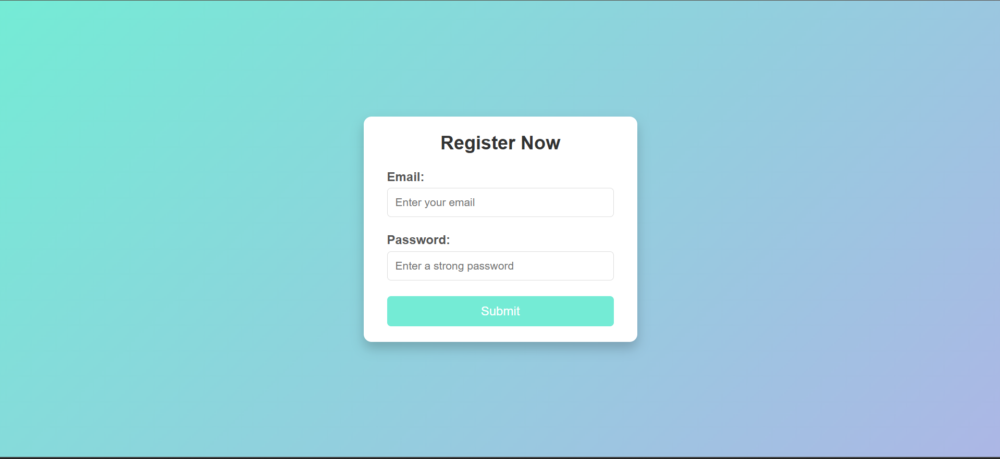

# 🌟 Dynamic Form Validation and DOM Manipulation
🎯 Enhance form validation and implement dynamic updates to the DOM for a smooth user experience.

---

## 🚀 Project Overview  
This project focuses on:  
1. 🌟 **Enhanced Form Validation**:  
   - Validating user input with complex rules (e.g., email format and password strength).
   
2. 🛠️ **Dynamic DOM Manipulation**:  
   - Live updates based on user actions using **JavaScript**.
     
3. ⚡ **Modern UI Design**:  
   - A visually appealing interface with responsive and interactive elements.
     
4. 📂 **Client-Side Routing**:  
   - Added functionality for smoother navigation.

---

## 🛠️ Tech Stack  
- **HTML5** 🌐  
- **CSS3** 🎨  
- **JavaScript** ⚙️  

---

## 📂 Folder Structure  

```plaintext
📦 Dynamic-Form-Validation
├── 📜 index.html        # Main HTML file
├── 🎨 styles.css        # CSS for styling
├── ⚙️ script.js         # JavaScript for logic
└── 📜 README.md         # Project Documentation
```
---
## ✨ Features
- **Validation Rules**:  
  - ✅ Email format validation.  
  - ✅ Password strength check (at least 8 characters, 1 uppercase, 1 special character).  

- **Dynamic DOM Updates**:  
  - 🔄 Instant feedback for invalid inputs.  
  - 🎉 Animated success/error messages.  

- **Responsive Design**:  
  - 🌐 Works seamlessly across devices!

---

## 🎨 Preview

✨ Here’s how the form looks:



---

## ⚙️ Getting Started

Follow these steps to set up and run the project on your local machine:

 **1️⃣ Clone the Repository**

```bash
git clone https://github.com/your-username/dynamic-form-validation.git
```
**2️⃣ Navigate to the Project Directory**

```bash
cd dynamic-form-validation
```
**3️⃣ Open in Browser**

simply open **index.html** in your browser to see the magic.

---

## 💻 Code Snippets

### Email Validation Code:

```javascript
emailInput.addEventListener('input', () => {
    const emailRegex = /^[^\s@]+@[^\s@]+\.[^\s@]+$/;
    if (!emailRegex.test(emailInput.value)) {
        emailError.textContent = "❌ Invalid email address!";
    } else {
        emailError.textContent = "✅ Looks good!";
    }
});
```
---

## 🏆 Project Goals

* To improve real-world development skills by working with:

✅ Advanced JavaScript functionality.

✅ Modern UI/UX practices.

✅ Dynamic user interactions.

---

## 🌟 Future Enhancements

- 🔧 Add client-side routing for navigation.

- 📊 Integrate with a backend for user authentication.

- ✨ Add dark mode toggle for better user experience.

---

## 👨‍💻 Contributing

Contributions are always welcome! Feel free to fork the repository, make changes, and submit a pull request.

---

## 📧 Contact

If you have any queries or feedback:

* Email: lokeshv2403@gmail.com
* LinkedIn: [Lokesh-v](https://www.linkedin.com/in/lokesh-v-13873a284?utm_source=share&utm_campaign=share_via&utm_content=profile&utm_medium=android_app)
* Twitter: [lokesh07](https://x.com/me_lokesh07)


